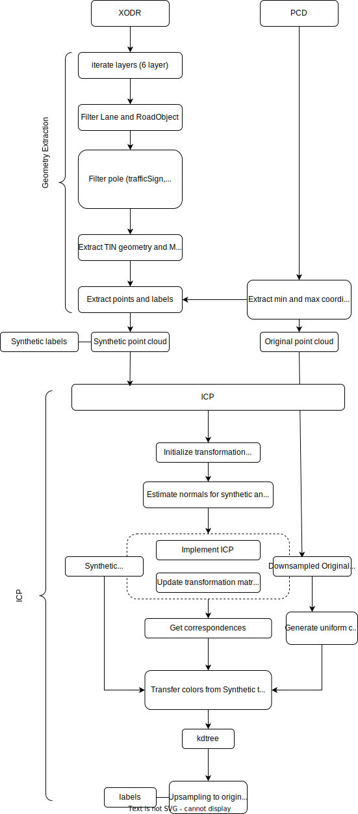

# msc_thesis report


## Code usage; 

### Virtual Environment 
```bash
python3 -m venv .venv 
``` 
```bash
source .venv/bin/activate  
```
Deactivate virtual environment and remove venv directory:
```bash
deactivate
rm -r .venv 
```
Install dependencies:
```bash
pip install -r requirements.txt
```
Env. variables 
```bash
source set_env.sh
```

## Segcontrast
https://github.com/PRBonn/segcontrast

```bash
sudo apt install build-essential python3-dev libopenblas-dev
```
```bash
pip3 install --no-cache-dir -r requirements.txt
```
```bash
pip3 install torch ninja
```
```bash
pip3 install -U git+https://github.com/NVIDIA/MinkowskiEngine --install-option="--blas=openblas" -v --no-deps
```


## General algortihm flowchart: 
```bash
python3 src/main.py --xodr_path "/home/thesis/data/map.xodr" --pcd_dir "/home/thesis/data/" --output_dir "/home/thesis/data/"
```


